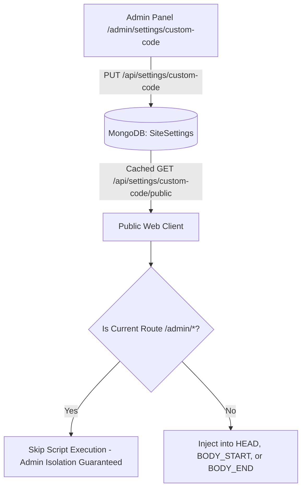

# Kraviona Custom Code Management: Comprehensive Guide

The Kraviona **Custom Code Management** system allows website administrators to inject, configure, and manage third-party analytics, tracking beacons, verification tags, and custom scripts dynamically without deploying new code.

---

## 1. Architectural Overview



### Safety Principles
1. **Zero Admin Pollution**: Custom scripts are strictly prevented from loading when the route begins with `/admin`. This prevents third-party script crashes from locking administrators out of the dashboard.
2. **Page Scoping**: Code snippets can be scoped sitewide or restricted to specific page contexts (e.g. tools only).
3. **Pre-Save Syntax Validation**: A built-in validation engine scans for unclosed `<script>` and `<style>` tags before changes can be persisted.
4. **Public Read Endpoint**: An unauthenticated endpoint (`GET /api/settings/custom-code/public`) provides the frontend client with sanitized, active snippets only.

---

## 2. Injection Positions & Optimal Placements

| Position | Target HTML Container | Recommended Use Cases |
| :--- | :--- | :--- |
| **Head Code** | Directly inside `<head>...</head>` | Google Tag Manager head snippet, Google Analytics (gtag.js), Google Search Console verification meta tags, Meta Pixel base code, Microsoft Clarity, pre-render stylesheets. |
| **Body Start Code** | Immediately following `<body>` opening tag | Google Tag Manager `<noscript>` fallback iframes, hidden tracking pixel fallbacks. |
| **Body End Code** | Immediately before closing `</body>` tag | Live chat widgets (Crisp, Intercom), user feedback forms, heavy third-party telemetry beacons that must not block initial rendering. |

---

## 3. Supported Vendor Implementations

### 3.1 Google Tag Manager (GTM)
- **Container 1 (Head Code)**:
  ```html
  <!-- Google Tag Manager -->
  <script>(function(w,d,s,l,i){w[l]=w[l]||[];w[l].push({'gtm.start':
  new Date().getTime(),event:'gtm.js'});var f=d.getElementsByTagName(s)[0],
  j=d.createElement(s),dl=l!='dataLayer'?'&l='+l:'';j.async=true;j.src=
  'https://www.googletagmanager.com/gtm.js?id='+i+dl;f.parentNode.insertBefore(j,f);
  })(window,document,'script','dataLayer','GTM-XXXXXXX');</script>
  <!-- End Google Tag Manager -->
  ```
- **Container 2 (Body Start Code)**:
  ```html
  <!-- Google Tag Manager (noscript) -->
  <noscript><iframe src="https://www.googletagmanager.com/ns.html?id=GTM-XXXXXXX"
  height="0" width="0" style="display:none;visibility:hidden"></iframe></noscript>
  <!-- End Google Tag Manager (noscript) -->
  ```

### 3.2 Google Analytics 4 (GA4)
- **Placement**: **Head Code**
  ```html
  <!-- Google tag (gtag.js) -->
  <script async src="https://www.googletagmanager.com/gtag/js?id=G-XXXXXXXXXX"></script>
  <script>
    window.dataLayer = window.dataLayer || [];
    function gtag(){dataLayer.push(arguments);}
    gtag('js', new Date());
    gtag('config', 'G-XXXXXXXXXX');
  </script>
  ```

### 3.3 Google Search Console & Bing Verification
- **Placement**: **Head Code**
  ```html
  <meta name="google-site-verification" content="YOUR_VERIFICATION_TOKEN" />
  <meta name="msvalidate.01" content="YOUR_BING_VERIFICATION_TOKEN" />
  ```

### 3.4 Meta Pixel (Facebook)
- **Placement**: **Head Code**
  ```html
  <!-- Meta Pixel Code -->
  <script>
  !function(f,b,e,v,n,t,s)
  {if(f.fbq)return;n=f.fbq=function(){n.callMethod?
  n.callMethod.apply(n,arguments):n.queue.push(arguments)};
  if(!f._fbq)f._fbq=n;n.push=n;n.loaded=!0;n.version='2.0';
  n.queue=[];t=b.createElement(e);t.async=!0;
  t.src=v;s=b.getElementsByTagName(e)[0];
  s.parentNode.insertBefore(t,s)}(window, document,'script',
  'https://connect.facebook.net/en_US/fbevents.js');
  fbq('init', 'YOUR_PIXEL_ID');
  fbq('track', 'PageView');
  </script>
  <!-- End Meta Pixel Code -->
  ```

### 3.5 Microsoft Clarity
- **Placement**: **Head Code**
  ```html
  <script type="text/javascript">
      (function(c,l,a,r,i,t,y){
          c[a]=c[a]||function(){(c[a].q=c[a].q||[]).push(arguments)};
          t=l.createElement(r);t.async=1;t.src="https://www.clarity.ms/tag/"+i;
          y=l.getElementsByTagName(r)[0];y.parentNode.insertBefore(t,y);
      })(window, document, "clarity", "script", "YOUR_CLARITY_ID");
  </script>
  ```

---

## 4. Operational & Rollback Procedures

### Adding or Updating a Snippet
1. Navigate to `/admin/settings/custom-code`.
2. Locate the designated section (Head, Body Start, or Body End).
3. Paste your code into the code editor.
4. Set the toggle to **Enabled**.
5. Click **Validate Syntax** to check for missing closing tags.
6. Click **Save Changes**.

### Emergency Killswitch
If a newly deployed third-party script causes browser console errors or affects page performance:
1. Immediately log in to `/admin/settings/custom-code`.
2. Toggle the switch for the affected block to **Disabled**.
3. Click **Save Changes**.
4. The client injector immediately halts script rendering on subsequent page navigations.
